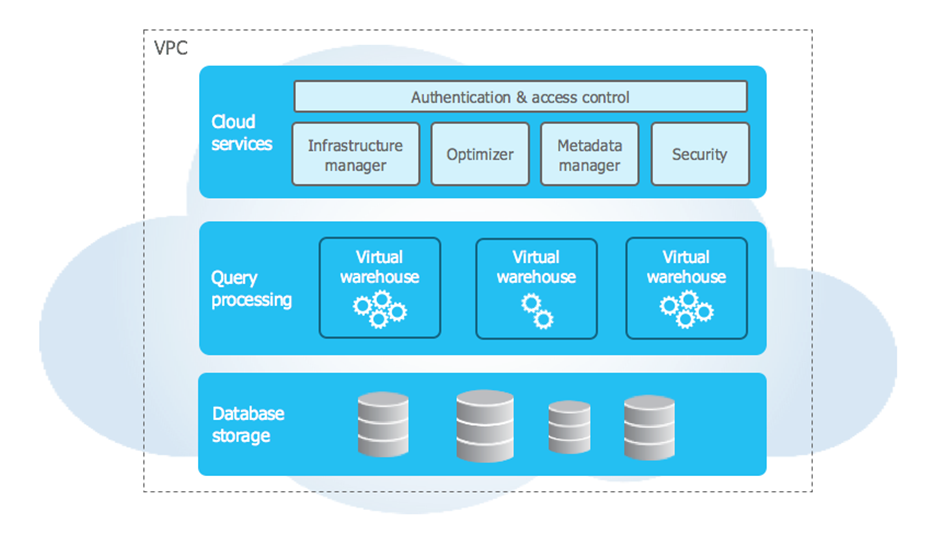
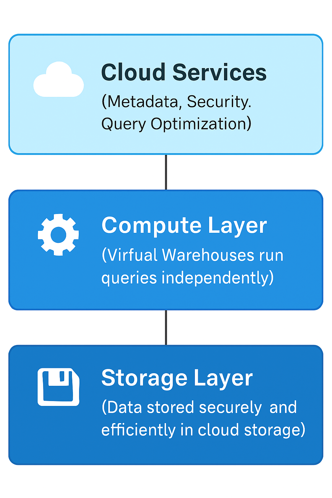

## Basic Interview Questions:

#### QUES 1: What is Snowflake? What are the essential features of Snowflake?
##### Answer: Snowflake is a cloud-based data warehousing platform that separates compute from storage, allowing users to scale their processing resources and data storage independently. This process is more cost-effective and produces high performance.


Features of Snowflake:
* Automatic Scaling/Elasticity: Snowflake’s architecture allows for dynamic scaling of both compute and storage resources. It can automatically scale up or down based on workload requirements, ensuring optimal performance and cost efficiency.
* Separation of Compute and Storage: Snowflake separates the storage and compute layers, enabling independent scaling of both components. This flexibility allows businesses to scale compute resources for high-demand workloads without affecting storage and vice versa.
* Native Support for Semi-structured Data: Snowflake natively supports semi-structured data formats like JSON, Avro, and Parquet, which eliminates the need for pre-processing before ingestion.
* Zero Management: Snowflake is a fully managed service, meaning that it takes care of database management tasks like indexing, tuning, and partitioning, reducing administrative overhead.
* Concurrency: Snowflake can handle multiple concurrent users and workloads without impacting performance, thanks to its multi-cluster architecture.
* Data Sharing: Snowflake allows businesses to securely share data in real-time across different organizations without the need to replicate or move the data, enhancing collaboration.
* Security and Compliance: Snowflake includes robust security measures such as encryption (at rest and in transit), role-based access control (RBAC), multi-factor authentication, and compliance with standards like HIPAA and PCI DSS.
* Time Travel: Allows you to access historical data (up to 90 days) using AT or BEFORE clause.
* Zero-copy cloning: Creates a copy of database/table without duplicating the data — fast and storage-efficient.

#### Ques2:	What are Virtual Warehouses in Snowflake?
##### Virtual Warehouses are the compute resources used to perform all DML (Data Manipulation Language) operations, such as:
*	Querying data
*	Loading data
*	Unloading data
*	Cloning
*	Creating tables/views
* They do not store data — storage is separate.Instead, warehouses handle computation and processing.

##### Key Points:
* Dedicated compute clusters that can be started, stopped, and resized independently.

* Each warehouse consists of a cluster of servers running in the cloud.

* Warehouses are independent of storage, allowing scalable compute without impacting data storage.

* They enable concurrent query execution by isolating workloads across multiple warehouses.

* You pay for the compute resources (credits) only when warehouses are running.

* Warehouses can be configured for auto-suspend and auto-resume to save costs.

| Feature     | Description                             |
| ----------- | --------------------------------------- |
| Purpose     | Perform all compute operations          |
| Scalability | Independently sized and scaled          |
| Isolation   | Separates workloads to avoid contention |
| Cost        | Pay per use while warehouse is running  |

##### Interview Tip:
* Think of virtual warehouses as Snowflake’s “compute engines” that power your data workloads with flexibility and elasticity.

#### 2.	What is a Snowflake Schema?
##### A Snowflake Schema is a type of data warehouse schema design that is a normalized version of a star schema. In a snowflake schema:
*	Dimension tables are split into multiple related tables (normalized).
*	This creates a "snowflake" shape in the ER diagram — hence the name.
##### 🧱 Structure of a Snowflake Schema
*	Fact Table (central): Contains measurable, quantitative data (e.g., sales amount, revenue).
*	Dimension Tables (surrounding): Describe the context (e.g., customer, product, time).
*	Each dimension may have sub-dimensions, which leads to a multi-level structure.

#### Ques 3.	Difference between Database, Schema, and Table in Snowflake?
##### These are hierarchical structures used to organize and manage data in Snowflake.

| **Component** | **Description**                                                            | **Example**                     |
| ------------- | -------------------------------------------------------------------------- | ------------------------------- |
| **Database**  | Top-level container in Snowflake. It groups schemas together.              | `SALES_DB`                      |
| **Schema**    | A logical grouping of database objects like tables, views, functions, etc. | `PUBLIC`, `RAW_DATA`, `STAGING` |
| **Table**     | Stores actual data in rows and columns. Defined inside a schema.           | `CUSTOMERS`, `ORDERS`           |


📘 Hierarchy
 Database  →  Schema  →  Table

	
#### Ques 4.	What is Fail-safe in Snowflake?
##### Fail-safe in Snowflake is a 7-day period after the Time Travel retention period during which Snowflake can recover historical data, but only in emergencies — like system failures or accidental data loss.
________________________________________
#### 🕒 Fail-safe Lifecycle
1.	Active Data: Data is available and queryable.
2.	Time Travel Period (up to 90 days):
o	You can manually query or restore dropped/changed data using AT or BEFORE clauses.
3.	Fail-safe Period (7 days after Time Travel ends):
*	You cannot access the data directly.
*	Only Snowflake Support can recover data for disaster recovery.


#### Ques 5. What is Time Travel in Snowflake?
##### Time Travel in Snowflake is a feature that allows you to query, clone, and restore data from a previous point in time.
It’s like having a rewind button for your tables, schemas, and databases — useful for recovering from mistakes, auditing, or recreating past states of your data.
________________________________________
Key Points
1.	Purpose
o	Recover data that was deleted or modified.
o	Inspect historical versions for audits and debugging.
o	Create clones of tables/schemas/databases from a historical point.
2.	Default Retention Period
o	Standard Edition: 1 day (24 hours).
o	Enterprise Edition & above: Up to 90 days.
o	Configurable at table, schema, or database level.
3.	How it Works
o	Snowflake stores immutable micro-partitions.
o	When data changes, Snowflake doesn’t overwrite; it creates new micro-partitions and keeps old ones until the Time Travel retention expires.
o	Queries with AT or BEFORE retrieve those historical micro-partitions.
________________________________________
Example Usage
```sql
-- Query a table as it was 2 hours ago
SELECT * 
FROM SALES_DB.PUBLIC.CUSTOMERS
AT(OFFSET => -2*60*60);

-- Query table as it was before a specific timestamp
SELECT * 
FROM SALES_DB.PUBLIC.CUSTOMERS
BEFORE(TIMESTAMP => '2025-08-08 08:00:00');

-- Clone a table from 3 days ago
CREATE TABLE CUSTOMERS_CLONE 
CLONE SALES_DB.PUBLIC.CUSTOMERS
AT(TIMESTAMP => '2025-08-05 10:00:00');

-- Undrop a table
UNDROP TABLE SALES_DB.PUBLIC.CUSTOMERS;
```
________________________________________
Benefits
*	Accidental deletion recovery (no panic needed when someone runs DELETE without a WHERE).
*	Zero-copy cloning for testing older states   *without using extra storage.
*	Audit & compliance — see exactly what data looked like in the past.


#### Ques 6. How Does Snowflake Handle Concurrency?
##### Concurrency in Snowflake refers to the ability to handle multiple users or processes running queries simultaneously without conflicts or performance degradation.
Snowflake handles concurrency automatically and efficiently, using its multi-cluster shared data architecture.
________________________________________
✅ Key Mechanisms Snowflake Uses to Handle Concurrency
| Mechanism                                    | Description                                                                                                                 |
| -------------------------------------------- | --------------------------------------------------------------------------------------------------------------------------- |
| **Multi-Cluster Virtual Warehouses**         | Snowflake can automatically start additional compute clusters for a warehouse if many users or queries are running at once. |
| **Independent Compute & Storage**            | Since compute (virtual warehouses) and storage are separated, many users can query the same data without interfering.       |
| **Automatic Query Queuing & Load Balancing** | If all clusters are busy, queries are temporarily queued and executed once resources free up.                               |
| **Result Caching**                           | If a query has already been executed, Snowflake may return results from cache, avoiding repeated work.                      |


#### Ques 7.  What is Zero-Copy Cloning in Snowflake?
##### Zero-copy cloning is a unique Snowflake feature that allows you to create a full copy of a database, schema, or table instantly — without duplicating the actual data.
* ✅ No physical data copy = zero additional storage cost (initially)
* ✅ Fast and efficient — clones are created in seconds
* ✅ Ideal for dev, test, backup, and branching use cases
##### 🧠 How It Works
*	Clone shares the underlying storage (data blocks) with the original.
*	Any changes after cloning (in either object) are stored separately — called copy-on-write.
*	So you pay only for new or modified data, not for the full clone.
##### Limitations
*	Clone and original share the same data until modified → deleting original may affect Time Travel of the clone
*	No cross-account cloning (only within same Snowflake account)
*	Does not copy external stages or file formats.

## Intermediate interview questions in Snowflakes:

#### Ques 1: Explain Snowflake Architecture.

  
##### Snowflake Architecture Explained (Image source: [Snowflake documentation](https://docs.snowflake.com/en/user-guide/intro-key-concepts))


Snowflake is a cloud-native data platform built with a unique architecture that separates storage, compute, and services, enabling scalability, concurrency, and elasticity.

1. Database Storage Layer
*	Stores all data in cloud storage (AWS S3, Azure Blob, or Google Cloud Storage).
*	Data is automatically compressed, encrypted, and stored in immutable micro-partitions (~16 MB each).
*	Storage scales independently of compute.
*	Allows data sharing and time travel by versioning stored data.
________________________________________
2. Compute Layer (Virtual Warehouses)
*	Consists of independent, MPP (Massively Parallel Processing) clusters called Virtual Warehouses.
*	Warehouses perform all query processing: scanning, filtering, joining, aggregating.
*	Multiple warehouses can run concurrently without resource contention.
*	Warehouses can auto-scale (multi-cluster) to handle concurrency or auto-suspend/resume to optimize cost.
________________________________________
3. Cloud Services Layer
*	Manages metadata, query parsing/planning, security, authentication, transaction management, and optimizations.
*	Coordinates tasks like query compilation, result caching, and access control.
*	Handles user sessions, cloud infrastructure management, and storage management.
*	This layer is fully managed by Snowflake, transparent to users.
________________________________________
🔄 How the Layers Work Together
1.	User submits a query to Snowflake.
2.	Cloud Services layer parses and plans the query.
3.	Compute layer (virtual warehouse) executes the query by accessing data from the storage layer.
4.	Results are returned to the user, with metadata updated by Cloud Services.
________________________________________
##### 📊 Key Benefits of Snowflake’s Architecture
| **Feature**                     | **Benefit**                                                           |
| ------------------------------- | --------------------------------------------------------------------- |
| Separation of Compute & Storage | Scale storage and compute independently, pay only for what you use    |
| Multi-Cluster Warehouses        | Handle unlimited concurrency by spinning up multiple compute clusters |
| Automatic Scaling               | Warehouses can auto-suspend/resume to optimize costs                  |
| Secure Data Sharing             | Share live data instantly without copying or moving data              |
| Time Travel & Fail-safe         | Query and recover historical data safely                              |
| Cloud Agnostic                  | Runs on AWS, Azure, or GCP seamlessly                                 |




#### Ques 2. What are micro-partitions in Snowflake, and what is its contribution to the platform's data storage efficiency?
###### Micro-partitions are the fundamental unit of data storage in Snowflake. They are immutable, compressed, columnar storage files that store a subset of table data.
________________________________________
###### Key Characteristics of Micro-Partitions:
*	Size: Typically around 16 MB of uncompressed data each.
*	Columnar Storage: Data within micro-partitions is stored column-wise, optimizing compression and query performance.
*	Immutable: Once created, micro-partitions are never updated; new data writes create new micro-partitions.
*	Metadata-rich: Each micro-partition stores metadata like min/max values, distinct values, and data statistics for columns.
________________________________________
###### Contribution to Storage Efficiency and Performance:
1. Efficient Data Compression
*	Columnar format allows Snowflake to apply high compression ratios, reducing storage footprint.
2. Automatic Partitioning
*	Snowflake automatically partitions tables into micro-partitions—no manual partitioning required.
3. Pruning (Partition Elimination)
*	Query optimizer uses micro-partition metadata (min/max column values) to skip irrelevant partitions, scanning only needed data.
*	This reduces I/O and speeds up queries significantly.
4. Immutable Storage & Time Travel
*	Immutable micro-partitions enable efficient versioning for features like Time Travel and Fail-safe, allowing queries on historical data without extra storage overhead.
5. Scalable & Distributed Storage
•	Micro-partitions enable Snowflake to scale storage seamlessly on cloud object stores, distributing data efficiently.
________________________________________
##### Summary Table
| **Feature**            | **Benefit**                         |
| ---------------------- | ----------------------------------- |
| Micro-partition Size   | Optimal balance of storage & access |
| Columnar Storage       | High compression, fast column scans |
| Metadata per Partition | Enables pruning, reduces query scan |
| Immutable              | Supports Time Travel & cloning      |
| Automatic              | Simplifies admin & tuning           |

________________________________________
##### 💡 Interview Tip:
Explain micro-partitions as Snowflake’s secret sauce that delivers fast queries by scanning minimal data, reduces storage costs through compression, and supports powerful features like Time Travel without user overhead.


#### Ques 3.	How do you load data into Snowflake from AWS S3?
##### Snowflake provides multiple ways to load data from Amazon S3, but the most common and efficient approach is:
###### Step-by-Step Process
1. Create a Stage (Reference to S3 Bucket)
*	Internal Stage → Data stored in Snowflake-managed storage
*	External Stage → Points to your S3 bucket

###### CREATE STAGE my_s3_stage
URL = 's3://my-bucket-name/path/'
STORAGE_INTEGRATION = my_s3_integration
FILE_FORMAT = (TYPE = CSV FIELD_OPTIONALLY_ENCLOSED_BY = '"' SKIP_HEADER = 1);

###### Create a Storage Integration (One-Time Setup)
This lets Snowflake access your S3 bucket securely.
```sql
CREATE STORAGE INTEGRATION my_s3_integration
  TYPE = EXTERNAL_STAGE
  STORAGE_PROVIDER = S3
  ENABLED = TRUE
  STORAGE_AWS_ROLE_ARN = 'arn:aws:iam::123456789012:role/my_snowflake_role'
  STORAGE_ALLOWED_LOCATIONS = ('s3://my-bucket-name/path/');
```
*	Then configure AWS IAM to trust Snowflake’s AWS account.
________________________________________
###### Create the Target Table in Snowflake
```sql
CREATE OR REPLACE TABLE sales_data (
    order_id INT,
    product_name STRING,
    quantity INT,
    price FLOAT,
    order_date DATE
);
```
________________________________________
###### Load Data from S3 to the Table
```sql
COPY INTO sales_data
FROM @my_s3_stage
FILE_FORMAT = (TYPE = CSV FIELD_OPTIONALLY_ENCLOSED_BY = '"' SKIP_HEADER = 1);
```
###### Snowflake reads the files from the S3 stage and loads them into the table. (Optional) Use Snowpipe for Continuous Loading
* If new files are regularly added to S3, set up Snowpipe for automated, near real-time ingestion:
```sql
CREATE PIPE my_pipe
AS
COPY INTO sales_data
FROM @my_s3_stage
FILE_FORMAT = (TYPE = CSV FIELD_OPTIONALLY_ENCLOSED_BY = '"' SKIP_HEADER = 1);
```
| **Step**            | **Why Important?**                        |
| ------------------- | ----------------------------------------- |
| Storage Integration | Secure connection between Snowflake & AWS |
| Stage               | Acts as a pointer to the S3 location      |
| COPY INTO           | Loads data from stage to Snowflake table  |
| File Format         | Defines how files are parsed              |
| Snowpipe            | Automates incremental loading             |


#### Ques 4:	What is the difference between internal and external stages?
##### In Snowflake, a stage is a storage location where files are placed before loading into tables or after unloading from tables.
##### Stages can be internal (Snowflake-managed storage) or external (your cloud storage like S3, Azure Blob, or Google Cloud Storage).

________________________________________
| Feature          | Internal Stage                                                    | External Stage                                                              |
| ---------------- | ----------------------------------------------------------------- | --------------------------------------------------------------------------- |
| Storage Location | Snowflake’s own managed cloud storage                             | Your cloud provider’s storage (AWS S3, Azure Blob, GCS)                     |
| Management       | Fully managed by Snowflake                                        | Managed by you (you control the bucket/container)                           |
| Setup Effort     | Minimal — no external credentials needed                          | Requires storage integration and cloud permissions                          |
| Performance      | High performance (data is already inside Snowflake’s ecosystem)   | Slightly more latency due to fetching from external cloud storage           |
| Security         | Controlled entirely by Snowflake                                  | Shared responsibility — must configure IAM roles, policies, and integration |
| Cost             | Storage costs billed by Snowflake                                 | Storage costs billed by your cloud provider                                 |
| Examples         | @my\_internal\_stage, @%my\_table (table stage), @\~ (user stage) | @my\_s3\_stage, @my\_azure\_stage                                           |
| Use Case         | Quick, ad-hoc file uploads; staging intermediate data             | Loading from or unloading to existing enterprise cloud storage              |


##### Ques 5.	What is a Snowpipe?
##### Snowpipe is Snowflake’s continuous data ingestion service that automatically loads data from a stage (internal or external) into a Snowflake table as soon as new files arrive — without the need to run manual COPY INTO commands each time.
Think of it as a "real-time-ish" loading pipeline (latency is usually seconds to minutes).

##### 🧠 How Snowpipe Works
1.	Data lands in a stage (S3, Azure Blob, GCS, or internal stage).
2.	Event notification from the cloud provider triggers Snowpipe.
3.	Snowpipe runs the COPY INTO command automatically.
4.	Data appears in your Snowflake table.

##### 📘 Basic Syntax
```sql
CREATE PIPE my_pipe
AS
COPY INTO target_table
FROM @my_stage
FILE_FORMAT = (TYPE = CSV FIELD_OPTIONALLY_ENCLOSED_BY='"');
```
*	Pipe = a named Snowpipe object that stores your COPY command definition.
*	Stage = location where your incoming files are stored.
________________________________________
##### 🔑 Key Features
| Feature            | Description                                                                    |
| ------------------ | ------------------------------------------------------------------------------ |
| Continuous Loading | Near real-time ingestion of files as they arrive                               |
| Serverless         | Snowflake manages compute resources automatically                              |
| Event-based        | Works with cloud notifications (S3 EventBridge, Azure Event Grid, GCS Pub/Sub) |
| Pay-per-use        | You pay only for the compute time Snowpipe uses                                |
| Monitoring         | Check load history via SYSTEM\$PIPE\_STATUS and UI dashboards                  |

________________________________________
##### 📊 Example Flow from S3
1.	New file is uploaded to S3 bucket.
2.	S3 Event Notification → AWS EventBridge → Snowflake REST endpoint.
3.	Snowpipe executes the COPY INTO defined in the pipe.
4.	Data is loaded into Snowflake table.
________________________________________
#### ✅ Benefits
*	No need for batch scheduling.
*	Scales automatically with incoming file volume.
*	Reduces latency between data arrival and availability in Snowflake.
*	Good for IoT, real-time analytics, and log processing.
________________________________________
#### ⚠️ Limitations
*	Not truly instantaneous — there’s usually a few seconds to a couple of minutes delay.
*	Requires proper event notification setup in your cloud provider.
*	Doesn’t transform data — only loads it as is.


#### Ques 6: How Does Data Sharing Work in Snowflake?
#### Snowflake’s Secure Data Sharing feature allows you to share live, read-only data with other Snowflake accounts — without copying or moving the data.
________________________________________
#### 🧠 Core Concept
*	Data stays in your Snowflake storage.
*	Consumers query your shared data directly.
*	No ETL, no file exports, no duplication → zero extra storage cost.
________________________________________
#### 🔍 How It Works
1.	Provider: The Snowflake account that owns the data.
2.	Consumer: The Snowflake account that queries the data.
3.	Share: A Snowflake object that contains:
*	Databases, schemas, tables, views to be shared
*	Access privileges for consumers
________________________________________
📘 Steps to Share Data
###### On Provider Side:
```sql
-- 1. Create a share
CREATE SHARE my_share;

-- 2. Add objects to share
GRANT USAGE ON DATABASE sales_db TO SHARE my_share;
GRANT USAGE ON SCHEMA sales_db.public TO SHARE my_share;
GRANT SELECT ON TABLE sales_db.public.orders TO SHARE my_share;

-- 3. Add consumer account
ALTER SHARE my_share ADD ACCOUNT = '<consumer_account_id>';
```
###### On Consumer Side:
```sql
-- 1. Create a database from the share
CREATE DATABASE sales_data FROM SHARE provider_account.my_share;

-- 2. Query it like any other table
SELECT * FROM sales_data.public.orders;
```
________________________________________
#### ✅ Types of Data Sharing
| Type                       | Description                                                                 |
| -------------------------- | --------------------------------------------------------------------------- |
| Direct Share               | Between two Snowflake accounts in the same region                           |
| Reader Account             | Provider creates a Snowflake account for a consumer who doesn’t have one    |
| Snowflake Marketplace      | Share datasets publicly or commercially                                     |
| Cross-Region / Cross-Cloud | Using Replication + Data Sharing to share across cloud providers or regions |

________________________________________
##### 📊 Benefits
*	Zero-copy → no duplication of data
*	Near real-time → consumers see updates instantly
*	Secure → provider controls exactly what is shared
*	Cost-efficient → consumers pay only for compute, provider pays for storage
________________________________________
##### ⚠️ Limitations
*	Consumer cannot modify shared data (read-only)
*	Only provider can change the shared objects
*	Cross-region sharing needs replication setup

----
#### Ques 7: What is clustering in Snowflake?
##### Clustering in Snowflake is the process of physically ordering the data in a table based on the values of one or more columns (clustering keys) to improve query performance — especially for large tables.

It helps Snowflake prune (skip) unnecessary micro-partitions when executing queries, reducing scan time and cost.
________________________________________
###### 🧠 Why Clustering Matters
* Snowflake stores data in micro-partitions (≈ 16 MB each) in an immutable way.
* If related rows are stored together, queries can skip scanning irrelevant partitions.
* Without clustering, data may be scattered randomly across micro-partitions → more scanning → slower queries → higher cost.

##### 📘 Types of Clustering
Type	Description
Automatic Clustering	Snowflake manages clustering in the background (Enterprise edition or higher).
Manual Clustering	You explicitly define clustering keys and periodically recluster the table using ALTER TABLE … RECLUSTER.

##### 🔍 Example: Creating a Clustered Table
```sql

CREATE TABLE orders (
    order_id INT,
    customer_id INT,
    order_date DATE,
    total_amount FLOAT
)
CLUSTER BY (order_date, customer_id);
```

##### ⚡ How Clustering Improves Performance
*	Partition Pruning: Skip reading partitions that don’t match the filter.
*	Faster Queries: Especially for range queries and large analytic workloads.
*	Lower Costs: Less data scanned = lower compute usage.

##### ✅ Best Practices
*	Choose clustering keys used frequently in WHERE, JOIN, or GROUP BY clauses.
*	Avoid clustering small tables (no performance gain).
*	Monitor clustering depth via:
```sql

SELECT SYSTEM$CLUSTERING_INFORMATION('orders', '(order_date, customer_id)');
```
*	Consider automatic clustering for frequently updated large tables.

##### ⚠️ Limitations
*	Over-clustering can increase storage and maintenance costs.
*	Works best for large, wide tables with predictable query patterns.


----
##### Ques 8:	What are Streams and Tasks in Snowflake?

##### Streams and Tasks in Snowflake
In Snowflake, Streams and Tasks are features that help with automation and incremental data processing — often used together for near real-time ETL/ELT pipelines.
________________________________________
######  Streams — Change Data Capture (CDC) in Snowflake
* A Stream is a change tracking object that records inserts, updates, and deletes made to a table.
* It allows you to query only the delta (new/changed rows) since the last time you read from the stream.
##### 📌 Key Points:
*	Acts like a pointer to changes in a table.
*	Can be append-only or standard (includes updates/deletes).
*	Automatically advances its offset when queried.
*	Used for incremental data processing.
##### Example:
```sql
-- Create a stream to track changes in the orders table
CREATE OR REPLACE STREAM orders_stream ON TABLE orders;

-- Query only new/changed rows
SELECT * FROM orders_stream;

-- After reading, Snowflake marks these rows as consumed for that stream
```

######  Tasks — Scheduled or Event-Driven Jobs
* A Task is a Snowflake object that lets you schedule SQL statements (including those that process streams) to run:
*	On a schedule (cron-like)
* 	Or in a task tree (triggered by another task)
###### 📌 Key Points:
*	Ideal for automation of ELT pipelines.
*	Runs in the background using Snowflake-managed compute.
*	Can be paused/resumed.
*	Can trigger stored procedures or SQL scripts.
###### Example:
```sql
-- Create a task to load stream data into a reporting table every hour
CREATE OR REPLACE TASK process_orders_task
  WAREHOUSE = my_wh
  SCHEDULE = 'USING CRON 0 * * * * UTC'
AS
INSERT INTO orders_reporting
SELECT * FROM orders_stream;
```

##### 🚀 How They Work Together
A common pattern is:
1.	Stream tracks changes in a table.
2.	Task reads from the stream and processes data periodically.
3.	This creates a near real-time ETL pipeline without manually managing offsets.
Flow:
```sql
Source Table → Stream (tracks changes) → Task (runs SQL/ETL logic) → Target Table
```
________________________________________
##### ✅ Benefits
*	No need to maintain manual offset tracking.
*	Handles both batch and near-real-time processing.
*	Fully serverless for orchestration (only warehouse cost for execution).
*	Easy to chain multiple tasks for complex workflows.


##### Ques 9.	What is automatic clustering?
###### Automatic Clustering is a Snowflake feature that automatically maintains the clustering of a table based on a defined clustering key — without manual RECLUSTER commands.

##### 📌 Why Clustering Matters
*	Large Snowflake tables are stored in micro-partitions (immutable blocks ~16MB each).
*	Over time, as data is inserted/updated, the natural order of data can degrade (fragmentation).
*	This causes queries with filtering to scan more micro-partitions than necessary → higher cost & slower performance.
*	Clustering improves pruning efficiency, meaning Snowflake can skip scanning irrelevant micro-partitions.

##### 🔹 How Automatic Clustering Works
*	You define a clustering key on a table (columns that are often used in WHERE, JOIN, GROUP BY).
*	Snowflake monitors the table for clustering degradation.
*	In the background, Snowflake reorganizes micro-partitions to maintain clustering.
*	You do not need to run ALTER TABLE ... RECLUSTER manually.

##### 🔹 Enabling Automatic Clustering
```sql

-- Create a clustered table with automatic clustering enabled
CREATE TABLE orders (
  order_id INT,
  customer_id INT,
  order_date DATE
)
CLUSTER BY (order_date);

ALTER TABLE orders SET AUTOMATIC_CLUSTERING = TRUE;
```
________________________________________
#### ⚙️ Internals
*	Serverless operation → Snowflake manages compute in the background.
*	Pay-per-use → You are charged separately for clustering maintenance (tracked in AUTOMATIC_CLUSTERING_HISTORY view).
*	Asynchronous → Re-clustering does not happen instantly, but on a schedule based on changes.
________________________________________
##### ✅ Benefits
*	No manual RECLUSTER needed.
*	Optimized query performance on large tables.
*	Fully managed — you just set it and forget it.
________________________________________
##### ⚠️ Limitations
*	Extra cost — charged separately from warehouse compute.
*	Works best for very large, frequently queried tables.
*	Not needed if your table is small or naturally ordered.
________________________________________
##### 💡 Interview Tip: If asked, mention that Automatic Clustering is great for time-series or partitioned-like datasets, but for small datasets or one-time loads, the cost may outweigh the benefit.

##### Ques 10.	What is a Materialized View and how is it different from a regular View?
Materialized View (MV) in Snowflake
##### A Materialized View is a precomputed and stored result of a query in Snowflake.

Unlike a regular (logical) view, which just stores the SQL definition and runs the query every time you use it, a materialized view stores the query result data and keeps it automatically updated when the underlying table changes.
________________________________________
##### 📌 Difference Between Regular View & Materialized View
| Feature           | Regular View                                       | Materialized View                                        |
| ----------------- | -------------------------------------------------- | -------------------------------------------------------- |
| Definition        | Just a stored SQL query                            | Stored SQL query + stored data                           |
| Data Storage      | No physical storage for results                    | Stores results in micro-partitions (takes storage space) |
| Query Performance | Slower for large data because query runs each time | Faster because results are precomputed                   |
| Maintenance       | No maintenance needed                              | Snowflake automatically refreshes when source changes    |
| Cost              | Only query cost when used                          | Storage cost + maintenance compute cost                  |
| Use Case          | Good for small or infrequently queried datasets    | Good for large datasets with frequent repeated queries   |

________________________________________
🔹 Example
```sql
-- Create a regular view
CREATE VIEW daily_sales_view AS
SELECT order_date, SUM(amount) AS total_sales
FROM orders
GROUP BY order_date;

-- Create a materialized view
CREATE MATERIALIZED VIEW daily_sales_mv AS
SELECT order_date, SUM(amount) AS total_sales
FROM orders
GROUP BY order_date;
```
With daily_sales_mv:
*	Querying is faster because Snowflake retrieves precomputed results.
*	Snowflake refreshes the view when orders changes.
________________________________________
##### ✅ Advantages of Materialized Views in Snowflake
*	Query speed → great for analytical dashboards.
*	Automatic refresh → no need for manual update jobs.
*	Micro-partition pruning → very efficient for filtered queries.

##### ⚠️ Limitations
*	Can only be created on single tables (no multi-table joins except certain cases).
*	Cannot include non-deterministic functions (like CURRENT_TIMESTAMP()).
*	Additional storage and refresh costs.

##### 💡 Interview Tip:
If they ask "When would you use a Materialized View over a Regular View?" — 
say:
######  "When performance is critical for repeated queries on large datasets and the underlying data changes frequently but not constantly, so precomputing results saves cost and time."


----

##### Ques 11 : How do you monitor and optimize performance in Snowflake?
###### Monitoring Performance
Snowflake provides several built-in tools & SQL functions for performance monitoring:
1. QUERY_HISTORY View
*	Found in SNOWFLAKE.ACCOUNT_USAGE or INFORMATION_SCHEMA.
*	Shows execution time, warehouse used, query text, etc.
```sql
SELECT query_id, execution_status, execution_time, total_elapsed_time, warehouse_name
FROM SNOWFLAKE.ACCOUNT_USAGE.QUERY_HISTORY
WHERE start_time >= DATEADD('hour', -1, CURRENT_TIMESTAMP);
```
2. Query Profile
*	Available in Snowsight UI → click a query → Query Profile.
*	Visualizes query stages, joins, partitions scanned, and execution bottlenecks.
3. Warehouse Monitoring
*	UI → Warehouses → History shows CPU usage, queries running, and queue times.
*	Helps detect if you need to scale up/out.
4. Resource Monitors
*	Prevent unexpected cost by setting credit limits and usage alerts.
________________________________________
#####  Optimization Techniques
1. Right-Sizing Warehouses
*	Avoid using oversized warehouses — start small, scale only if needed.
*	Use multi-cluster warehouses for high concurrency.
2. Micro-Partition Pruning
*	Snowflake stores data in micro-partitions (~16MB each).
*	Ensure queries filter on clustered columns to reduce scanned data.
3. Clustering Keys
*	Define clustering keys for large tables to improve pruning.
```sql
ALTER TABLE sales CLUSTER BY (order_date);
```
*	Use automatic clustering to maintain order without manual reclustering.
4. Caching
*	Snowflake caches query results for 24 hours in the same session.
*	Leverage Result Cache & Warehouse Cache to avoid recomputation.
5. Materialized Views
*	Precompute heavy aggregations to avoid expensive repeated scans.
6. Avoid SELECT 
*	Select only the columns needed to reduce I/O.
7. Partition & Join Optimization
*	Filter early in subqueries.
*	Ensure join keys are the same data type to avoid implicit casting.
________________________________________
##### Performance Tuning Workflow
1.	Identify slow queries → Use QUERY_HISTORY and Query Profile.
2.	Check data scanned → Minimize scanned micro-partitions.
3.	Adjust warehouse size → Scale up for faster execution, scale out for concurrency.
4.	Add clustering keys or materialized views if patterns are repeated.
5.	Refactor SQL → Remove unnecessary CTEs, break down complex queries.

#### 💡 Interview Tip
If they ask “How do you know if a query is slow due to compute or data organization?”
*	If query is queued → scale out (multi-cluster).
*	If query scans too much data → optimize clustering/partitioning.
*	If compute time is high but scan is small → check query logic & joins.

________________________________________
##### Ques 12 :	How does caching work in Snowflake?
###### Caching in Snowflake
Snowflake has three main layers of caching, each with a different scope and duration:
________________________________________
1. Result Cache (24 hours per query)
*	What it is: Stores the final query results for identical queries run by the same role, regardless of warehouse size.
*	Scope: Account-level, shared across users.
*	Duration: 24 hours (unless underlying data changes).
*	Cost: Free — doesn’t use compute.
*	When used: If you run the exact same query with the same parameters and data hasn’t changed.
####	Example:
```sql
SELECT COUNT(*) FROM sales WHERE region = 'US';
-- Runs once and stores result
-- Running again within 24h returns instantly from cache
```
#######	Gotcha: If any underlying table changes, cache is invalidated.
________________________________________
2. Local Disk Cache (Warehouse-level, per session)
*	What it is: Stores data from micro-partitions read during queries on the warehouse’s SSD/local storage.
*	Scope: Specific to the warehouse instance.
*	Duration: Until warehouse is suspended or restarted.
*	Cost: Requires compute to be running.
*	When used: If two queries access the same micro-partitions within the same warehouse session, Snowflake avoids re-reading from cloud storage.
#####	Example:
First query loads the needed partitions → second query reuses them faster.
________________________________________
3️. Remote Disk Cache (Persistent storage cache)
*	What it is: Snowflake keeps frequently ac
cessed micro-partitions in remote SSD cache for quicker retrieval than going to cloud storage (S3, Azure Blob, GCS).
*	Scope: Persistent at the service level.
*	Duration: Managed by Snowflake — no direct control.
*	Cost: Uses compute when processed, but storage is Snowflake’s cost.
________________________________________
##### How They Work Together
When you run a query:
1.	Check Result Cache → If identical query & unchanged data → return instantly.
2.	If not in result cache → Check Local Disk Cache → If partitions are cached in warehouse → read them directly.
3.	If not found → Check Remote Disk Cache → Faster than fetching from cloud storage.
4.	If still not found → Fetch from cloud storage → Store in caches for next time.
________________________________________
Performance Tip to benefit from caching:
* Keep warehouses running during batch query sessions.
*	Reuse the same warehouse for related queries.
*	Avoid unnecessary data changes if you want to reuse Result Cache.

##### 💡 Interview-ready one-liner:
“Snowflake has three caching layers — 
* result cache for final query results (24h, free), 
* local disk cache in the warehouse for reused partitions, and 
* remote disk cache for frequently accessed micro-partitions — all designed to reduce data scans and improve performance.”

________________________________________

###### Advanced interview questions :
##### Ques 1:  	What are the best practices for Snowflake performance tuning?
Best Practices for Snowflake Performance Tuning
Optimizing performance in Snowflake involves tuning warehouse sizing, data organization, and query design. Here are the top best practices:
1. Right-Size Your Virtual Warehouses
*	Start with a small or medium warehouse; scale up only if queries are slow.
*	Use multi-cluster warehouses to handle high concurrency.
*	Enable auto-suspend and auto-resume to save cost during idle periods.
2. Optimize Data Storage & Clustering
*	Use clustering keys on large tables frequently filtered or joined on specific columns.
*	Enable automatic clustering (Enterprise+ editions) to maintain clustering without manual effort.
*	Minimize the size of micro-partitions scanned by filtering on clustered columns.
*	Use partition pruning to reduce data scanned.

3. Use Caching Effectively
*	Leverage result cache by avoiding unnecessary data changes and re-running the same queries.
*	Reuse the same warehouse session to benefit from local disk cache.
*	Query patterns that hit cached data run much faster and cheaper.

4. Write Efficient Queries
*	Avoid SELECT *; select only necessary columns.
*	Filter data as early as possible in query logic.
*	Use joins on columns with the same data type to prevent implicit casts.
*	Avoid complex nested queries when possible; break them into simpler steps.
*	Use CTEs (Common Table Expressions) wisely, as Snowflake may materialize them.

5. Use Materialized Views & Result Caching
*	Create materialized views for expensive, frequently run aggregation queries.
*	Materialized views reduce query time by storing precomputed results.
*	Use result caching and be mindful of underlying data changes.

6. Monitor & Analyze Query Performance
*	Use QUERY_HISTORY and Query Profile to identify slow queries or bottlenecks.
*	Check warehouse usage and query queuing to decide if you need more clusters or bigger warehouses.
*	Use Resource Monitors to keep costs in check.

7. Optimize Data Loading
*	Use bulk loading for large data ingestion.
*	Avoid small, frequent loads that cause overhead.
*	Use Snowpipe for near real-time streaming ingestion.

8. Manage Metadata and Object Sizes
*	Avoid excessive small files or very large files—optimize file size (~100 MB is often recommended).
*	Regularly vacuum and optimize tables if using manual clustering.

9. Leverage Time Travel and Fail-safe Wisely
*	Set data retention periods appropriately to balance recovery needs and storage costs.
*	Purge old data when no longer needed.

🧠 Quick Summary Table:
| Practice                | Benefit                           |
| ----------------------- | --------------------------------- |
| Right-size warehouses   | Cost-effective scaling            |
| Clustering & pruning    | Faster scans, less data processed |
| Caching                 | Instant results, reduced compute  |
| Efficient SQL           | Reduced processing time           |
| Materialized views      | Precomputed aggregates            |
| Query monitoring        | Identify & fix bottlenecks        |
| Bulk loading & Snowpipe | Efficient data ingestion          |

-----
##### Ques 2: What’s the difference between transient and temporary tables?
###### Difference Between Transient and Temporary Tables in Snowflake
Both transient and temporary tables are used for short-term data storage, but they have key differences in scope, data retention, and usage.
________________________________________
| Feature              | Transient Tables                                | Temporary Tables                                                     |
| -------------------- | ----------------------------------------------- | -------------------------------------------------------------------- |
| Data Persistence     | Persist beyond the session until dropped        | Exist only for the current session                                   |
| Storage Costs        | Charged normally for storage                    | Charged normally for storage                                         |
| Fail-safe Protection | No fail-safe period (storage cost saved)        | No fail-safe (same as transient)                                     |
| Time Travel          | Supported (default 1 day, configurable)         | Supported but only within the session                                |
| Visibility Scope     | Visible to all users in the same DB/Schema      | Visible only within the current session                              |
| Use Case             | Temporary but shared data, short-term workflows | Session-specific temporary data, e.g., intermediate steps in scripts |
| Lifetime             | Until explicitly dropped                        | Until session ends or disconnects                                    |
| Syntax               | `CREATE TRANSIENT TABLE my_table ...`           | `CREATE TEMPORARY TABLE my_temp_table ...`                           |
________________________________________
##### 📌 When to Use Which?
*	Transient Tables:
Use when you want a temporary table shared across sessions/users but don’t want fail-safe storage costs or longer data retention.
Good for short-term staging or intermediate data during ETL.
*	Temporary Tables:
Use for session-scoped temporary data that is discarded after your session ends.
Ideal for scripts, transformations, or testing within a single session.
________________________________________
#### Example:
```sql
-- Transient table
CREATE TRANSIENT TABLE temp_data AS SELECT * FROM source_table;

-- Temporary table
CREATE TEMPORARY TABLE session_data AS SELECT * FROM source_table;
```


##### Ques 3: What is column-level security in Snowflake?

Column-level security restricts user access to specific columns within a table, so sensitive data (like PII) is protected from unauthorized users while allowing access to other columns.
________________________________________
##### How Snowflake Implements Column-Level Security
Snowflake doesn’t have native, built-in column-level permissions like some databases, but you can enforce it using:
1. Dynamic Data Masking (DDM)
*	Define masking policies to obfuscate or hide column data based on user roles or conditions.
*	Masking policies are applied dynamically when users query the data.
Example:
```sql
CREATE MASKING POLICY ssn_mask AS
  (val STRING) RETURNS STRING ->
  CASE
    WHEN CURRENT_ROLE() IN ('FULL_ACCESS_ROLE') THEN val
    ELSE 'XXX-XX-XXXX'
  END;

ALTER TABLE employees
ALTER COLUMN ssn SET MASKING POLICY ssn_mask;
```
2. Views with Selective Columns
*	Create secure views exposing only allowed columns.
*	Grant users access to views instead of base tables.
Example:
```sql

CREATE VIEW employees_public AS
SELECT id, name, department FROM employees;

GRANT SELECT ON employees_public TO ROLE public_role;
```
3. Row Access Policies (for finer-grained control)
*	Though mostly for row filtering, combined with views, they help enforce column access too.

##### Why Use Column-Level Security?
| Benefit                      | Description                             |
| ---------------------------- | --------------------------------------- |
| Protect sensitive info (PII) | Hide or mask columns like SSN, salary   |
| Minimize overexposure        | Limit what data users see               |
| Compliance                   | Meet GDPR, HIPAA, and other regulations |
| Flexible access control      | Dynamic based on roles or context       |

________________________________________
#### Summary Table
| Method               | Pros                         | Cons                     |
| -------------------- | ---------------------------- | ------------------------ |
| Dynamic Data Masking | Real-time, flexible masking  | Complex for many columns |
| Views                | Simple, familiar concept     | Maintenance overhead     |
| Row Access Policies  | Combine row + column control | More complex setup       |

##### 💡 Interview Tip:
If asked about column-level security, mention Dynamic Data Masking as Snowflake’s preferred way, complemented by secure views for easier role-based column restrictions.

------
##### Ques 4: How would you implement data masking in Snowflake?
##### Snowflake uses Dynamic Data Masking (DDM) through Masking Policies to protect sensitive data by controlling how column values appear based on the querying user’s role or context.

###### Step-by-Step: Implementing Data Masking in Snowflake
1. Create a Masking Policy
A masking policy is a SQL function that defines how to mask or transform column data dynamically.
```sql
CREATE MASKING POLICY ssn_mask AS
  (val STRING) RETURNS STRING ->
  CASE
    WHEN CURRENT_ROLE() IN ('FULL_ACCESS_ROLE') THEN val
    ELSE 'XXX-XX-XXXX'  -- mask value for unauthorized users
  END;
```

2. Apply the Masking Policy to a Column
Attach the masking policy to the sensitive column in your table.
```sql
ALTER TABLE employees
ALTER COLUMN ssn
SET MASKING POLICY ssn_mask;
```

3. Grant Roles and Access
*	Make sure users with role FULL_ACCESS_ROLE can see unmasked data.
*	Other roles will see masked values.
```sql

GRANT ROLE FULL_ACCESS_ROLE TO USER alice;
```

4. Query the Table
*	Users with the allowed role see full data:
```sql

SELECT ssn FROM employees;
-- Output: 123-45-6789
```
*	Users without the allowed role see masked data:
```sql

SELECT ssn FROM employees;
-- Output: XXX-XX-XXXX
```

###### Additional Tips
*	Masking policies can be more complex, using multiple roles or even checking user/session context.
*	You can mask other data types (e.g., numbers, dates).
*	Combine with secure views or row access policies for comprehensive data protection.

Example: Masking a Salary Column
```sql

CREATE MASKING POLICY salary_mask AS
  (val NUMBER) RETURNS NUMBER ->
  CASE
    WHEN CURRENT_ROLE() IN ('HR_ROLE') THEN val
    ELSE NULL
  END;

ALTER TABLE employees
ALTER COLUMN salary
SET MASKING POLICY salary_mask;
```

##### Summary:
| Step | Action                                               |
| ---- | ---------------------------------------------------- |
| 1    | Create Policy – Define masking logic                 |
| 2    | Apply Policy – Attach policy to column               |
| 3    | Assign Roles – Control which roles see unmasked data |
| 4    | Query – Masking applied automatically                |

----
##### Ques 5:	How would you set up role-based access control (RBAC)?
Snowflake uses a hierarchical role model to manage permissions securely and flexibly. Here’s a step-by-step approach to set up RBAC:

##### Step 1: Create Roles
Create roles that reflect job functions or access levels in your organization.
```sql

CREATE ROLE analyst_role;
CREATE ROLE developer_role;
CREATE ROLE admin_role;
```
##### Step 2: Grant Privileges to Roles
Assign privileges (like SELECT, INSERT, USAGE) on databases, schemas, tables, or warehouses to roles.
```sql

-- Allow analysts to read from sales schema
GRANT USAGE ON DATABASE my_db TO ROLE analyst_role;
GRANT USAGE ON SCHEMA my_db.sales TO ROLE analyst_role;
GRANT SELECT ON ALL TABLES IN SCHEMA my_db.sales TO ROLE analyst_role;

-- Allow developers to modify data
GRANT INSERT, UPDATE, DELETE ON ALL TABLES IN SCHEMA my_db.sales TO ROLE developer_role;

-- Admin role gets all privileges
GRANT ALL PRIVILEGES ON DATABASE my_db TO ROLE admin_role;
```

##### Step 3: Establish Role Hierarchy (Optional)
Grant roles to other roles to create a hierarchy, simplifying privilege management.
```sql

GRANT ROLE analyst_role TO ROLE developer_role;  -- Developers inherit analyst privileges
GRANT ROLE developer_role TO ROLE admin_role;    -- Admin inherits developer privileges
```

##### Step 4: Assign Roles to Users
Grant the appropriate roles to individual users.
```sql

GRANT ROLE analyst_role TO USER alice;
GRANT ROLE developer_role TO USER bob;
GRANT ROLE admin_role TO USER charlie;
```

##### Step 5: Set Default Role for Users (Optional)
You can set a default role that activates when a user logs in.
```sql

ALTER USER alice SET DEFAULT_ROLE = analyst_role;
```

##### Step 6: Use Roles in Sessions
Users activate roles in their sessions to access permissions.
```sql

-- Switch to a specific role in session
USE ROLE analyst_role;
```

##### Best Practices
*	Follow the principle of least privilege: assign only the minimal necessary permissions.
*	Use custom roles tailored to your organization’s structure.
*	Regularly audit role assignments and privileges.
*	Combine RBAC with object tagging and masking policies for fine-grained control.
________________________________________
##### Summary Table:
| Step             | Description                             |
| ---------------- | --------------------------------------- |
| Create Roles     | Define roles by job function            |
| Grant Privileges | Assign object and warehouse permissions |
| Build Hierarchy  | Nest roles to simplify management       |
| Assign to Users  | Map users to appropriate roles          |
| Default Role     | Define user default active role         |


##### Ques 6:	What is the role of the metadata service in Snowflake?
The Metadata Service is a critical component in Snowflake’s Cloud Services Layer that manages all metadata operations related to your data and queries.
________________________________________
Key Responsibilities of Metadata Service:
1. Metadata Management
•	Stores and manages metadata about databases, schemas, tables, columns, users, roles, and privileges.
•	Keeps track of data location, structure, and versions (for Time Travel).
2. Query Parsing and Optimization
•	Parses SQL queries submitted by users.
•	Optimizes query execution plans based on metadata (statistics, clustering info).
3. Transaction Management
•	Manages ACID transactions ensuring atomicity, consistency, isolation, and durability.
•	Coordinates concurrent query execution and data consistency.
4. Security & Access Control
•	Enforces role-based access control (RBAC).
•	Validates user privileges before allowing data access.
5. Data Sharing & Cloning Metadata
•	Tracks shared data objects and permissions in data sharing scenarios.
•	Manages metadata for zero-copy cloning of databases, schemas, and tables.
6. Resource Monitoring & Auditing
•	Maintains logs for queries, warehouse usage, and user activity.
•	Provides data for monitoring and auditing tools.
________________________________________
Why Metadata Service Matters
Benefit	Explanation
Centralized Metadata Store	Ensures consistent metadata across all Snowflake components
Seamless Query Optimization	Helps generate efficient query execution plans
Strong Security Enforcement	Controls access based on metadata-driven policies
Enables Features like Time Travel and Cloning	Keeps track of data versions and snapshots
________________________________________
Summary
The Metadata Service acts like Snowflake’s brain, orchestrating query planning, security checks, and metadata storage, making sure your data access is fast, consistent, and secure.


##### Ques 7:	How does Snowflake handle semi-structured data?

 Snowflake provides native support for semi-structured data formats like JSON, Avro, Parquet, ORC, and XML — enabling you to load, store, query, and analyze such data without complex transformations.
________________________________________
Key Features for Semi-Structured Data in Snowflake:
1️⃣ VARIANT Data Type
•	Snowflake’s VARIANT is a flexible column type that can store semi-structured data in its native hierarchical form.
•	You can store JSON or other formats directly in a VARIANT column.
________________________________________
2️⃣ Loading Semi-Structured Data
•	Load JSON, Avro, Parquet, etc., directly into VARIANT columns using COPY INTO or Snowpipe.
•	Snowflake auto-parses and stores the data efficiently.
________________________________________
3️⃣ Querying Semi-Structured Data
•	Use dot notation or bracket notation to access nested fields in VARIANT columns.
•	Supports powerful SQL functions for semi-structured data:
o	FLATTEN to unnest arrays
o	OBJECT_KEYS to get keys of objects
o	TO_VARIANT, TO_JSON for conversions
Example:
sql
CopyEdit
SELECT data:customer.name, data:items[0].price
FROM orders;
________________________________________
4️⃣ Optimization
•	Semi-structured data is stored in compressed micro-partitions.
•	Snowflake applies pruning and clustering on VARIANT columns to optimize queries.
________________________________________
5️⃣ Integration with Structured Data
•	Combine semi-structured data with relational tables and join across both data types seamlessly.
________________________________________
Summary Table
Feature	Description
VARIANT Type	Flexible container for semi-structured data
Direct Loading	Load JSON, Avro, Parquet natively
Query Support	Dot/bracket notation, FLATTEN function
Performance	Efficient storage & pruning
Integration	Works alongside structured data
________________________________________
💡 Interview Tip:
Mention Snowflake’s native VARIANT type and rich SQL support as key advantages for handling semi-structured data without ETL complexity.
________________________________________

##### Ques 8:	How do you migrate a large on-premise DW to Snowflake?
Migrating a large on-premise DW to Snowflake involves careful planning, data transfer, schema conversion, and testing. Here’s a structured approach:

1. Assessment and Planning
*	Analyze existing DW: data volume, schema complexity, dependencies, and ETL processes.
*	Define migration goals: full migration or hybrid, downtime tolerance, performance expectations.
*	Choose migration tools: native Snowflake utilities, third-party ETL/ELT tools (e.g., Informatica, Talend, Matillion), or custom scripts.

2. Schema and Object Migration
*	Extract schema definitions (tables, views, stored procedures).
*	Use tools like Snowflake Schema Conversion Tool or manual conversion to Snowflake SQL dialect.
*	Convert data types and object definitions compatible with Snowflake.
*	Create the schema objects in Snowflake.

3. Data Migration
*	Bulk Data Export: Export data from on-premise DW to flat files (CSV, Parquet, JSON).
*	Data Transfer: Upload files to a cloud storage bucket compatible with Snowflake (e.g., AWS S3, Azure Blob, Google Cloud Storage).
*	Load Data: Use Snowflake’s COPY INTO command or Snowpipe for continuous ingestion.
*	Consider partitioning and compression to optimize load speed.

4. ETL/ELT Process Migration
*	Redesign ETL workflows to leverage Snowflake’s scalable compute and SQL capabilities.
*	Use ELT pattern when possible — load raw data first, then transform inside Snowflake.
*	Replace legacy procedures with Snowflake tasks, streams, and stored procedures.

5. Testing and Validation
*	Run parallel queries in old DW and Snowflake to validate data accuracy.
*	Test performance benchmarks and optimize warehouses accordingly.
*	Validate security roles and access controls.

6. Cutover and Go-Live
*	Plan cutover with minimal downtime.
*	Use Snowflake data sharing or replication for zero-downtime migration if needed.
*	Monitor post-migration workload and tune for performance.

7. Optimization and Monitoring
*	Set up monitoring using Snowflake’s query history, warehouse metrics.
*	Implement clustering, materialized views, and caching for performance tuning.
*	Train teams on Snowflake best practices.

Summary Table
| Phase             | Key Activities                          |
| ----------------- | --------------------------------------- |
| Assessment        | Analyze existing DW and plan migration  |
| Schema Migration  | Convert and create schema in Snowflake  |
| Data Migration    | Export, transfer, and load data         |
| ETL/ELT Migration | Adapt ETL to Snowflake’s ELT model      |
| Testing           | Data validation and performance testing |
| Cutover           | Switch production workloads             |
| Optimization      | Monitor and tune for best performance   |


💡 Interview Tip:
Emphasize the cloud storage integration, schema conversion challenges, and leveraging Snowflake’s elastic compute and native features (streams, tasks, cloning) for efficient migration.

________________________________________
##### Ques 9:	Explain Snowflake cost optimization strategies.
Snowflake Cost Optimization Strategies
Controlling costs in Snowflake requires managing compute, storage, and data transfer efficiently. Here are key strategies to optimize your Snowflake expenses:

1. Optimize Compute Costs
*	Right-size virtual warehouses:
Choose warehouse sizes that fit workload needs; avoid over-provisioning.
*	Auto-suspend and Auto-resume:
Configure warehouses to automatically suspend after inactivity and resume on demand to avoid paying for idle compute.
*	Use Multi-Cluster Warehouses wisely:
Scale out only when concurrency demands it, avoiding unnecessary clusters.
*	Use Resource Monitors:
Set credit usage limits and notifications to prevent unexpected cost spikes.
________________________________________
2. Optimize Storage Costs
*	Data retention period:
Keep Time Travel and Fail-safe retention periods as low as acceptable (default 1 day Time Travel; Fail-safe 7 days) to reduce storage.
*	Use Transient or Temporary Tables:
Avoid Fail-safe storage costs for temporary or staging data.
*	Data pruning:
Delete unnecessary data and compress large datasets effectively.
*	Use Cloning:
Zero-copy cloning avoids duplicating storage, saving space when creating test/dev copies.

3. Query & Data Access Optimization
*	Avoid SELECT: 
Only query needed columns to reduce data scanned and compute usage.
*	Use Materialized Views:
Cache expensive query results to reduce repeated compute usage.
*	Leverage Result Caching:
Run identical queries multiple times to benefit from cached results at no additional compute cost.

4. Data Loading Optimization
*	Bulk loads over small incremental loads:
Bulk loads reduce overhead and improve efficiency.
*	Use Snowpipe for continuous ingestion:
Automate data loading with cost-effective streaming.

5. Monitor & Analyze Costs Regularly
*	Use ACCOUNT_USAGE views and Snowsight dashboards to monitor credit usage and trends.
*	Analyze query cost patterns and optimize long-running or expensive queries.
*	Set up alerts on resource monitors.

Summary Table
| Strategy                 | Benefit                        |
| ------------------------ | ------------------------------ |
| Right-size warehouses    | Avoid overpaying for compute   |
| Auto-suspend/resume      | Save credits during idle times |
| Manage retention periods | Reduce storage cost            |
| Use transient tables     | Avoid fail-safe charges        |
| Optimize queries         | Reduce data scanned            |
| Monitor usage regularly  | Prevent surprises              |


##### 💡 Interview Tip:
Mention Snowflake’s separation of storage and compute allows independent cost control, and emphasize proactive monitoring + auto-scaling as key to cost efficiency.
________________________________________
##### Ques 10:Can you explain Snowflake's approach to data security, specifically its always-on encryption?
Snowflake is built with a security-first architecture, and one of its core pillars is always-on encryption — ensuring data is protected both at rest and in transit without any user action required.

##### Key Aspects of Snowflake’s Always-On Encryption
1. Encryption at Rest
*	All customer data, including tables, metadata, backups, and temporary files, is encrypted when stored.
*	Snowflake uses AES-256 encryption, a strong industry-standard symmetric encryption algorithm.
*	Data is stored in cloud object storage (AWS S3, Azure Blob, GCP Storage), but only encrypted ciphertext is saved.
*	Encryption keys are managed by Snowflake’s centralized key management system, with multiple layers of key wrapping and rotation.

2. Encryption in Transit
*	All data transferred between client applications and Snowflake, and internally between Snowflake services, is encrypted using TLS (Transport Layer Security) 1.2 or higher.
*	This protects data from interception or tampering during communication.

3. Key Management and Rotation
*	Snowflake employs a hierarchical key management system:
    *	Each customer’s data is encrypted with unique data encryption keys (DEKs).
    *	DEKs are encrypted with key encryption keys (KEKs).
    *	KEKs are regularly rotated and securely stored.
*	Snowflake handles key lifecycle and rotation automatically, transparent to users.

4. Additional Security Features
*	Role-Based Access Control (RBAC): Enforces fine-grained user permissions.
*	Network Policies: Control which IP addresses can connect.
*	Multi-Factor Authentication (MFA): Adds an extra security layer for user logins.
*	Data Masking: Protects sensitive data dynamically at the column level.
*	Compliance: Snowflake complies with certifications like SOC 2, HIPAA, PCI DSS, GDPR.

##### Why Always-On Encryption Matters
| Benefit                 | Description                                                  |
| ----------------------- | ------------------------------------------------------------ |
| Transparent Security    | No need for user intervention; encryption is automatic       |
| Protects Sensitive Data | Safeguards data from breaches or leaks                       |
| Meets Compliance        | Helps organizations satisfy regulatory requirements          |
| Secure Cloud Storage    | Even if cloud storage is compromised, data remains encrypted |


##### Summary:
| Layer           | Encryption Method        | Purpose                            |
| --------------- | ------------------------ | ---------------------------------- |
| Data at Rest    | AES-256                  | Protect stored data                |
| Data in Transit | TLS 1.2+                 | Protect data moving across network |
| Key Management  | Hierarchical & automated | Secure key lifecycle and rotation  |


##### 💡 Interview Tip:
When explaining always-on encryption, highlight that Snowflake secures data end-to-end automatically, ensuring compliance and reducing user overhead while maintaining performance.
________________________________________
##### Ques 11: Can you explain Snowflake's support for both ETL and ELT processes?
Snowflake is flexible and supports both ETL (Extract, Transform, Load) and ELT (Extract, Load, Transform) data integration patterns, making it suitable for various data workflows.

1. ETL (Extract, Transform, Load) in Snowflake
*	Process:
Data is extracted from source systems, transformed outside Snowflake (e.g., in an ETL tool or middleware), and then loaded into Snowflake as cleaned, structured data.
*	Use Case:
When complex transformations require external processing power or specialized tools, or when legacy ETL pipelines are already in place.
*	Snowflake Role:
Snowflake acts primarily as the target data warehouse to store and query transformed data.
________________________________________
2. ELT (Extract, Load, Transform) in Snowflake
*	Process:
Data is extracted from sources, loaded raw into Snowflake first, and transformed inside Snowflake using its powerful SQL engine.
*	Advantages:
    *  	Leverages Snowflake’s scalable compute for transformations.
    *	Reduces data movement and latency.
    *	Simplifies architecture by centralizing transformation logic.
    *	Snowflake Features Supporting ELT:
    *	Virtual Warehouses: Scalable compute clusters for transformation queries.
    *	Streams & Tasks: Automate incremental data processing and scheduling.
    *	Stored Procedures & UDFs: Encapsulate complex logic in Snowflake SQL or JavaScript.
    *	Materialized Views: Precompute and cache expensive queries.
________________________________________
##### Why ELT is Often Preferred in Snowflake
| Reason               | Explanation                                                           |
| -------------------- | --------------------------------------------------------------------- |
| Scalability          | Snowflake scales compute independently, enabling fast transformations |
| Simplified Pipelines | Raw data loaded first, transformations applied on demand              |
| Cost Efficiency      | Pay only for compute during transformation runs                       |
| Flexibility          | Easy to modify or add transformations using SQL                       |

________________________________________
##### Summary Table
| Feature        | ETL                                     | ELT                                 |
| -------------- | --------------------------------------- | ----------------------------------- |
| Transformation | Outside Snowflake                       | Inside Snowflake                    |
| Data Movement  | Extract → Transform → Load              | Extract → Load → Transform          |
| Tooling        | External ETL tools                      | Snowflake SQL & native features     |
| Performance    | Depends on external tools               | Leverages Snowflake’s compute       |
| Use Case       | Legacy systems, complex transformations | Modern cloud workflows, scalability |

##### 💡 Interview Tip:
Mention Snowflake’s architecture is ideal for ELT due to separation of storage and compute, allowing fast in-warehouse transformations, but it can also integrate easily with ETL tools if needed.

________________________________________


##### Ques 12 : Can you name at least 5 ETL tools that are compatible with Snowflake?
Snowflake supports a range of ETL tools, allowing organizations to use the tools they prefer when it comes to data integration and transformation tasks. The following tools can be used on Snowflake’s cloud data platform to process and move data into Snowflake for further analysis:
•	Informatica
•	Talend
•	Matillion
•	Fivetran
•	Stitch
•	Apache Airflow
•	dbt
•	StreamSets
•	Microsoft Azure Data Factory
•	AWS Glue

________________________________________

##### Ques 13: Can you explain how the advanced feature Snowpipe is used for continuous data ingestion?
Snowpipe is Snowflake’s serverless, continuous data ingestion service designed to load data automatically and near real-time from cloud storage into Snowflake tables.
 
High-level architecture of Snowpipe Streaming. Image source: Snowflake documentation.

###### How Snowpipe Works
1. Data Landing
*	New data files arrive in a cloud storage stage (e.g., AWS S3, Azure Blob Storage, or Google Cloud Storage).
*	Files can be placed manually, or generated by upstream systems.
2. Event Notification
*	Snowpipe listens for event notifications from the cloud storage service (like S3 event triggers).
*	When a new file arrives, an event notifies Snowpipe to start loading.
3. Automatic Loading
*	Snowpipe automatically executes COPY INTO commands to ingest new files into the target table.
*	It processes files incrementally and avoids duplicates using file metadata.
4. Continuous, Near Real-Time
*	Files are ingested continuously as they arrive — no manual intervention required.
*	Latency from file arrival to data availability is typically seconds to minutes.
________________________________________
#### Key Features of Snowpipe
| Feature             | Description                                                                            |
| ------------------- | -------------------------------------------------------------------------------------- |
| Serverless          | No infrastructure to manage; Snowflake handles scaling                                 |
| Event-Driven        | Uses cloud storage event notifications for automatic triggering                        |
| Incremental Loading | Loads only new files, avoiding duplicates                                              |
| Auto-Scaling        | Automatically scales to handle load spikes                                             |
| Integration         | Works with cloud storage (S3, Azure Blob, GCS) and messaging services like AWS SNS/SQS |


##### Summary:
| Architecture   | Strengths                                              | Weaknesses                                        |
| -------------- | ------------------------------------------------------ | ------------------------------------------------- |
| Shared-Disk    | Simplifies data consistency; single storage copy       | Storage contention; scalability limits            |
| Shared-Nothing | Highly scalable; no single point of storage bottleneck | Data partitioning complexity; data movement costs |


##### 💡 Interview Tip:
Explain Snowflake’s architecture is closer to shared-nothing, with compute clusters independent of cloud storage, enabling elastic scaling and high concurrency.

________________________________________

##### Ques 15: Define ‘Staging’ in Snowflake
##### When you load data into a stage in Snowflake, it is known as ‘Staging.’ 
* External staging is when the data is kept in another cloud region, and internal staging is when the data is kept inside Snowflake. 
* The internal staging is integrated within the Snowflake environment and stores files and data to load into Snowflake tables. 
* The Snowflake platform uses external storage location providers such as AWS, Google Cloud Platform, and Azure to store data that needs to be loaded or saved.
* Staging in Snowflake refers to the temporary storage location where data files are placed before they are loaded into Snowflake tables. It acts as an intermediate area to hold raw data during the loading process.
________________________________________
##### Types of Stages in Snowflake
1. Internal Stage
*	Managed by Snowflake inside its environment.
*	Includes:
    *	User stages (one per user)
    *   Table stages (one per table)
    *	Named internal stages created explicitly by users.
*	Convenient for short-term storage and loading.
2. External Stage
•	Points to external cloud storage locations like:
o	AWS S3 buckets
o	Azure Blob Storage
o	Google Cloud Storage
•	Useful for integrating with existing cloud data pipelines and large datasets.
________________________________________
##### Purpose of Staging
*	Temporary holding area: Data files (CSV, JSON, Parquet, etc.) are uploaded here before ingestion.
*	Separation of storage and compute: Enables Snowflake to load data efficiently from the staged files.
•	Data validation and control: Allows inspection and transformation before final load.
•	Supports Continuous Loading: External stages work with Snowpipe for automated ingestion.
________________________________________
##### Example Usage
```sql
-- Create an internal named stage
CREATE STAGE my_internal_stage;

-- Upload files to the stage (via SnowSQL or UI)

-- Load data from stage into a table
COPY INTO my_table FROM @my_internal_stage FILE_FORMAT = (TYPE = 'CSV');
```
________________________________________
Summary Table
| Feature        | Description                                  |
| -------------- | -------------------------------------------- |
| Staging Area   | Temporary data storage before loading        |
| Internal Stage | Snowflake-managed storage inside Snowflake   |
| External Stage | References external cloud storage locations  |
| Use Cases      | Data ingestion, batch and continuous loading |


##### 💡 Interview Tip:
Mention that staging is critical in Snowflake’s data loading architecture, providing flexibility and scalability for loading data from various sources.

________________________________________

##### Ques 16: What are the different types of caching in Snowflake?
Snowflake uses multiple caching layers to boost query performance and reduce compute costs by avoiding unnecessary data processing.
________________________________________
1. Result Cache
*	Stores the final results of queries for 24 hours.
*	If the same query (including text, parameters, and session context) is run again and the underlying data hasn’t changed, Snowflake returns results instantly without using compute resources.
*	Shared across all users.
________________________________________
2. Local Disk Cache (Warehouse Cache)
*	Each virtual warehouse caches data blocks (micro-partitions) on the local SSD storage of the compute nodes.
*	When a query accesses data that is already cached locally, Snowflake reads it from the cache, reducing latency and cloud storage I/O costs.
*	Cache is specific to the warehouse cluster and lost when the warehouse is suspended.
________________________________________
3. Metadata Cache
*	Metadata about table structures, micro-partition statistics, and query execution plans is cached in the Cloud Services layer.
*	Speeds up query parsing, optimization, and pruning by avoiding repeated metadata fetches.
________________________________________
##### Summary Table
| Cache Type       | What It Stores                 | Scope                   | Duration                       | Benefit                                 |
| ---------------- | ------------------------------ | ----------------------- | ------------------------------ | --------------------------------------- |
| Result Cache     | Query results                  | Across all users        | 24 hours or until data changes | Instant query response without compute  |
| Local Disk Cache | Data blocks (micro-partitions) | Warehouse compute nodes | Until warehouse suspends       | Faster data reads, reduces I/O and cost |
| Metadata Cache   | Table metadata, query plans    | Cloud Services layer    | Session or longer              | Faster query parsing and planning       |


##### 💡 Interview Tip:
Emphasize how Snowflake’s multi-layer caching helps optimize performance and cost by reusing previous computations and minimizing data scans.

________________________________________


##### Ques 17: Define the different states of the Snowflake Virtual Warehouse.
A Virtual Warehouse in Snowflake goes through several states that represent its lifecycle and availability for query processing:

| State      | Description                                                                                         |
| ---------- | --------------------------------------------------------------------------------------------------- |
| Started    | The warehouse is active and ready to process queries. Compute resources (servers) are running.      |
| Starting   | The warehouse is in the process of provisioning compute resources but isn’t ready yet.              |
| Suspended  | The warehouse is inactive; compute resources are released and not available for queries.            |
| Suspending | The warehouse is in the process of shutting down compute resources after finishing current queries. |
| Resuming   | The warehouse is transitioning from suspended to started to handle incoming queries.                |
| Failed     | The warehouse failed to start or encountered an error during operations.                            |


##### Additional Notes:
*	Warehouses can be configured with auto-suspend and auto-resume to automatically transition between started and suspended states based on query activity.
*	When a query is submitted to a suspended warehouse, Snowflake automatically resumes it (if auto-resume is enabled).
*	Proper management of warehouse states helps optimize costs by not paying for idle compute.

Summary Table
| State      | Action                      | User Impact                            |
| ---------- | --------------------------- | -------------------------------------- |
| Starting   | Provisioning compute        | Queries wait until ready               |
| Started    | Ready for queries           | Immediate query execution              |
| Suspending | Shutting down after queries | No new queries accepted                |
| Suspended  | No compute running          | Queries trigger auto-resume if enabled |
| Resuming   | Starting up compute         | Queries wait until ready               |
| Failed     | Error state                 | Manual intervention needed             |


💡 Interview Tip:
Highlight how Snowflake’s warehouse states and auto-suspend/resume features provide a cost-efficient, elastic compute model.

________________________________________
##### Ques 18: Can you describe the impact of the different states of virtual warehouses on query performance?
##### Impact of Virtual Warehouse States on Query Performance in Snowflake
The state of a Snowflake virtual warehouse directly affects how quickly queries can run and how system resources are used:

Warehouse State	Impact on Query Performance
###### Started	- Warehouse is fully operational.
* Queries execute immediately with minimal latency.
* Best performance experience.
Starting	- Warehouse is provisioning compute resources.
* Queries must wait until startup completes.
* Introduces some initial query latency (seconds).
###### Resuming	- Similar to Starting; warehouse is waking up from suspended.
* Queries wait until compute nodes are ready.
* Initial latency before queries run.
###### Suspended	- Warehouse is inactive; no compute available.
* Queries trigger warehouse auto-resume (if enabled).
* Queries wait for warehouse to resume before execution, causing delay.
###### Suspending	- Warehouse is shutting down.
* Queries already running complete.
* New queries are blocked until resumed or restarted.
* Temporary query delays.
###### Failed	- Warehouse is unavailable due to an error.
* Queries cannot run.
* Requires manual troubleshooting and restart.
________________________________________
##### Key Takeaways
1.	Auto-Resume Feature: Helps reduce delays by automatically starting the warehouse when queries arrive, but there’s always a startup delay (usually a few seconds).
2.	Auto-Suspend Feature: Saves cost but may increase latency for the first query after suspension due to warehouse startup.
•	For low-latency, high-concurrency workloads, keep warehouses started or use multi-cluster warehouses.
•	For cost savings on intermittent workloads, use auto-suspend with acceptance of slight query latency on first run.
________________________________________
##### Summary Table
| State             | Query Latency            | Compute Availability | Cost Impact                |
| ----------------- | ------------------------ | -------------------- | -------------------------- |
| Started           | Low                      | Full                 | Paying for active compute  |
| Starting/Resuming | Moderate (seconds delay) | Becoming available   | Paying during startup      |
| Suspended         | High (wait for resume)   | None                 | Not paying (compute off)   |
| Suspending        | Temporary delay          | Shutting down        | Reduced cost after suspend |
| Failed            | Queries fail             | Unavailable          | No compute until fixed     |


##### 💡 Interview Tip:
Explain the trade-off between cost and latency when configuring warehouse auto-suspend/resume, emphasizing how Snowflake balances these with flexible compute scaling.

________________________________________

##### Ques 19: How does Snowflake handle data distribution and partitioning within its architecture?
#### How Snowflake Handles Data Distribution and Partitioning
Snowflake’s architecture abstracts away traditional manual data distribution and partitioning by using automatic micro-partitioning and a shared-nothing architecture with centralized storage.
________________________________________
#### Key Concepts:
1. Automatic Micro-Partitioning
*	Snowflake automatically divides tables into micro-partitions, typically ~16 MB of compressed columnar data.
*	Micro-partitions are immutable, metadata-rich, and contain statistics like min/max values per column.
*	No manual partitioning required; Snowflake handles data organization transparently.
2. Metadata-Driven Pruning
*	Query optimizer uses micro-partition metadata to prune irrelevant partitions during query execution.
*	This reduces the amount of data scanned, improving query performance without explicit user partitioning.
3. Shared-Nothing Architecture
*	Compute resources (virtual warehouses) are decoupled from storage.
*	All compute nodes access the same centralized cloud storage.
*	This avoids data movement overhead between compute nodes and ensures consistent access.
4. Clustering Keys (Optional Manual Control)
*	Users can define clustering keys on large tables to co-locate related data within micro-partitions.
*	Helps optimize pruning and reduce query costs on very large datasets.
*	Snowflake also offers automatic clustering as a managed service to maintain clustering over time.
________________________________________
Summary Table
| Feature                | Description                                                   | User Control                |
| ---------------------- | ------------------------------------------------------------- | --------------------------- |
| Micro-Partitioning     | Automatic, fine-grained partitioning into small data blocks   | No manual effort needed     |
| Metadata Pruning       | Uses micro-partition stats to skip data during queries        | Fully automatic             |
| Shared-Nothing Storage | Centralized cloud storage accessed by all compute nodes       | Transparent                 |
| Clustering Keys        | Optional manual clustering to improve pruning on large tables | User-defined                |
| Automatic Clustering   | Managed background service to maintain clustering             | Optional, Snowflake-managed |

________________________________________
##### Benefits
*	Eliminates complex manual partitioning strategies.
*	Ensures scalable and performant queries.
*	Allows elastic compute scaling without data re-shuffling.
*	Reduces data scanned, lowering cost and latency.

#### 💡 Interview Tip:
Emphasize Snowflake’s automatic micro-partitioning combined with metadata pruning as a key innovation that simplifies data distribution and boosts query performance i  n a cloud-native, shared-nothing architecture.

________________________________________

##### Ques 20: Can you explain the role of the Metadata Service in Snowflake and how it contributes to performance?
##### Role of the Metadata Service in Snowflake and Its Contribution to Performance
The Metadata Service is a core component of Snowflake’s Cloud Services Layer responsible for managing all metadata related to data objects, security, query processing, and system operations.
________________________________________
##### Key Roles of the Metadata Service:
1. Metadata Management
*	Maintains metadata about databases, schemas, tables, columns, micro-partitions, users, roles, and privileges.
*	Tracks micro-partition statistics (e.g., min/max column values, distinct counts) crucial for query pruning.
2. Query Parsing and Optimization
*	Parses incoming SQL queries.
*	Uses metadata to generate optimized query execution plans.
*	Leverages micro-partition statistics to prune irrelevant data partitions, reducing I/O.
3. Transaction Coordination
*	Ensures ACID compliance by managing transaction states.
*	Coordinates concurrent query executions to maintain consistency.
4. Security Enforcement
*	Validates access controls and RBAC permissions using metadata before query execution.
5. Data Sharing and Cloning
*	Manages metadata for zero-copy cloning and secure data sharing, enabling instant data duplication without physical copying.
________________________________________
##### How Metadata Service Contributes to Performance
| Contribution              | Explanation                                                                                             |
| ------------------------- | ------------------------------------------------------------------------------------------------------- |
| Efficient Query Pruning   | Uses metadata stats to scan only relevant micro-partitions, speeding queries and lowering compute cost. |
| Optimized Query Plans     | Generates efficient execution plans based on object metadata and usage patterns.                        |
| Reduced Metadata Overhead | Centralized metadata avoids repeated fetches, enabling faster query compilation and execution.          |
| Concurrency Management    | Smooth coordination of concurrent queries enhances system throughput.                                   |

________________________________________
##### Summary Table
| Function               | Performance Impact                          |
| ---------------------- | ------------------------------------------- |
| Metadata Storage       | Enables quick lookup of data organization   |
| Query Optimization     | Faster and more efficient query execution   |
| Data Pruning           | Minimizes data scanned, reducing latency    |
| Transaction Management | Ensures consistency with minimal contention |
| Security Checks        | Fast authorization without query delays     |

________________________________________
##### 💡 Interview Tip:
Describe the Metadata Service as Snowflake’s "brain", coordinating metadata, query planning, and security to deliver fast, consistent, and scalable query performance.


##### Ques 21: How does Snowflake’s auto-suspend and auto-resume feature work, and why is it beneficial?
How Snowflake’s Auto-Suspend and Auto-Resume Feature Works and Its Benefits
________________________________________
##### How It Works:
1. Auto-Suspend
•	Automatically suspends a virtual warehouse after a specified period of inactivity (no queries running).
•	When suspended, compute resources are released, and you stop being billed for compute credits.
•	You configure the auto-suspend timeout (e.g., 1 minute, 5 minutes).
2. Auto-Resume
•	Automatically resumes the virtual warehouse when a new query or operation arrives after suspension.
•	The warehouse quickly spins up compute resources to handle the workload.
•	This process is transparent to the user, but initial queries after resume experience a slight startup delay (a few seconds).

##### Why It’s Beneficial:
| Benefit                   | Explanation                                                                          |
| ------------------------- | ------------------------------------------------------------------------------------ |
| Cost Savings              | Avoid paying for compute when warehouse is idle, reducing cloud costs significantly. |
| Operational Efficiency    | Removes need for manual warehouse management to start/stop compute.                  |
| Elasticity                | Warehouses scale automatically with workload demand, optimizing resource use.        |
| Simplified Administration | Users don’t have to remember to suspend or resume warehouses, reducing errors.       |

________________________________________
##### Summary Table
| Feature      | Description                      | User Benefit                      |
| ------------ | -------------------------------- | --------------------------------- |
| Auto-Suspend | Stops warehouse after idle time  | Saves compute costs               |
| Auto-Resume  | Starts warehouse on query demand | Ensures availability & elasticity |

________________________________________
##### 💡 Interview Tip:
Highlight how this feature balances cost control and performance availability seamlessly, enabling Snowflake’s pay-per-use model.