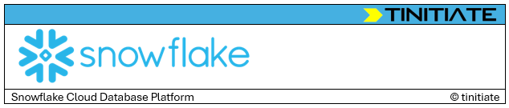

# Snowflake
> by (c) Tinitiate

OUR SNOWFLAKE SERVICES :
---
[Training]() | [Consulting]() | [OutSourcing]()
---

## Snowflake Platform
* [Architecture](architecutre.md)
## Snowflake SQL
## Snowflake TSQL
* [Dynamic tables](dynamic-tables.md)

## Advanced Features
* [Notebooks](snowflake-notebooks.md)
* [Snowpipe](snowpipe.md)
* [Snowpark](snowpark.md)
* CI/CD for ETL (3rd party)
* CI/CD for ETL native
* Code base, Monitoring, Scheduling
* TimeTravel
* Transient Tables
* Snowflake Streams & Audits
* Integrations
* Stages
* External Functions
* UDFs

## Interview QnA
* How does indexing, partitioning work behind the scenes
* How does snowflake autoscale
