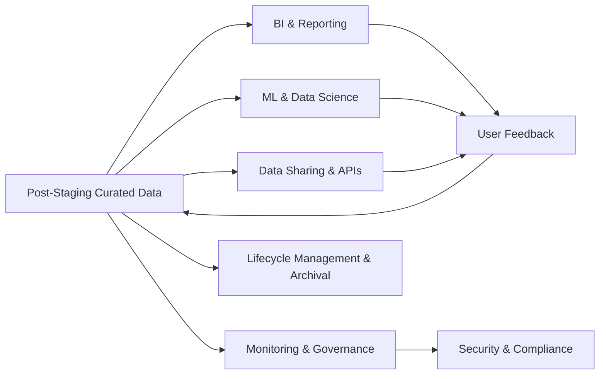
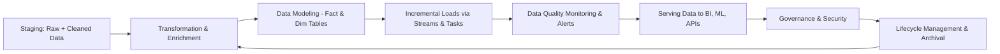

## Workflow Diagram
```mermaid
flowchart LR
A[Staging: Raw + Cleaned Data] --> B[Transformation & Enrichment]
B --> C[Data Modeling (Fact & Dim Tables)]
C --> D[Incremental Loads via Streams & Tasks]
D --> E[Data Quality Monitoring & Alerts]
E --> F[Serving Data to BI, ML, APIs]
F --> G[Governance & Security]
G --> H[Lifecycle Management & Archival]
H --> B
```


