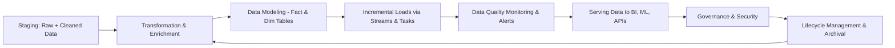

# Post-Staging Snowflake Workflow: What Happens After Data Cleansing & Validation

---

## 1. Refined Transformations & Business Logic Implementation

- **What:**  
  Apply domain-specific transformations aligned with business definitions:  
  - Calculate metrics like customer lifetime value (LTV), churn probability.  
  - Map raw codes to readable categories (e.g., product SKUs → product lines).  
  - Adjust time zones, normalize currency, apply fiscal calendar logic.

- **How:**  
  - Use SQL scripts maintained under version control (Git).  
  - Schedule jobs with orchestration tools (Airflow, Snowflake Tasks).  
  - Use Snowflake Streams + Tasks for incremental updates.

- **Example:**  
  ```sql
  CREATE OR REPLACE TABLE sales_curated AS
  SELECT
    order_id,
    customer_id,
    order_date,
    product_id,
    quantity,
    price,
    quantity * price AS revenue,
    DATE_TRUNC('month', order_date) AS order_month
  FROM sales_stage
  WHERE order_date >= CURRENT_DATE - INTERVAL '1 year';
  ```

---

## 2. Data Modeling & Schema Design

- **What:**  
  Build fact and dimension tables (star schema) optimized for analytics.  
  Maintain Slowly Changing Dimensions (SCD) where necessary.

- **How:**  
  - Use dbt (data build tool) for modular, version-controlled transformations.  
  - Create Views or Materialized Views for query performance.

- **Industry Example:**  
  Healthcare analytics models patient encounters (facts) with provider, diagnosis, and procedure dimensions.

---

## 3. Incremental Processing & Change Data Capture (CDC)

- **What:**  
  Capture and process only new or changed data to avoid full reloads.

- **How:**  
  - Use Snowflake Streams to track data changes.  
  - Automate workflows using Snowflake Tasks triggered on schedule/events.

- **Example:**  
  Retail chains update daily sales within hours after stores close.

---

## 4. Data Quality Monitoring & Alerts

- **What:**  
  Monitor data health post-transformation to catch anomalies early.

- **How:**  
  - Build dashboards with key metrics (counts, null rates).  
  - Set automated alerts through orchestration tools (Slack/email).

- **Example:**  
  Alert if daily sales volume drops below 80% of the 30-day average.

---

## 5. Serving Data to Consumers

- **BI & Reporting:**  
  Connect Tableau, Power BI, Looker directly to curated Snowflake tables.

- **Data Science & ML:**  
  Access via Snowflake connectors or Snowpark for in-warehouse ML.

- **Data Sharing:**  
  Use Snowflake Secure Data Sharing to provide data access without copying.

---

## 6. Governance & Security

- Enforce Role-Based Access Control (RBAC).  
- Apply Dynamic Data Masking for sensitive data.  
- Audit data usage with Access History.  
- Ensure encryption in transit and at rest.

---

## 7. Data Lifecycle Management

- Use Time Travel for point-in-time recovery (7 to 90 days retention).  
- Archive cold data to external storage (AWS S3, Azure Blob) using External Tables.  
- Purge obsolete data per compliance requirements.

---

## 8. Performance Optimization

- Use clustering keys for large table pruning.  
- Create materialized views for expensive aggregations.  
- Monitor query performance and optimize SQL.  
- Scale warehouses or use auto-scaling as workload demands.

---

## Workflow Diagram

---

*This document summarizes typical post-staging Snowflake workflows as applied in industry projects.*
