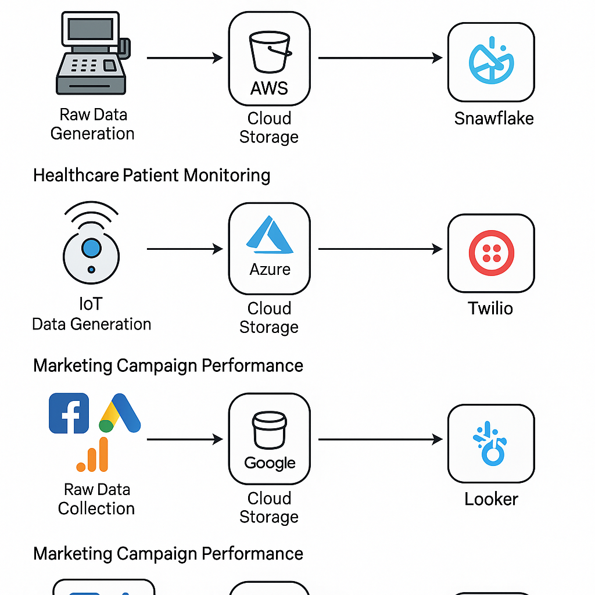

# Snowflake in the Real World – Practical Industry Workflow

## 1. Real-World Context: Where Snowflake Fits
In industry, Snowflake is almost never used alone. It’s part of a **larger data ecosystem**:

- **Source systems:** Applications, IoT devices, CRMs, ERPs, third-party APIs, public datasets.
- **Staging/landing:** Cloud storage (AWS S3 / Azure Blob / GCP GCS) where raw data lands first.
- **ETL/ELT orchestration:** Tools like dbt, Airflow, AWS Glue, Matillion, Fivetran, Informatica.
- **Data warehouse:** Snowflake for storage, query, sharing, and security.
- **Consumption:** BI tools (Tableau, Power BI, Looker), ML pipelines, API endpoints.

---

## 2. Practical Industry Workflow

### Step 1: Raw Data Identification & Classification
**Why?** You need to know what’s coming in before you store it.

- **Sources:** Logs, clickstream, IoT telemetry, survey results, EHR/EMR systems in healthcare, finance transactions.
- **Format check:** JSON, Parquet, Avro, XML, CSV, Excel dumps.
- **Metadata tagging:**
  - Data owner
  - Data sensitivity (PII/PHI/PCI)
  - Update frequency (batch/stream)
  - Retention needs (compliance rules like HIPAA/GDPR)

> **Industry reality:**  
> Companies use **data catalogs** (Collibra, Alation, or Snowflake’s own Object Tags) to track what’s allowed in Snowflake vs. what must stay in secure vaults.

---

### Step 2: Raw Landing Zone
Before Snowflake touches the data, it usually lands in **cheap cloud storage**:

- **AWS:** S3 bucket  
- **Azure:** Blob Storage  
- **GCP:** Cloud Storage  

**Why?**
- Cheaper than directly loading into Snowflake.
- Keeps a raw, immutable backup in case of ingestion errors.
- Compliance benefit — “we have the untouched original.”

---

### Step 3: Ingestion into Snowflake
Different ingestion patterns are used depending on data type & latency:

| Data Type                  | Tool/Method                          | Example                  |
|----------------------------|--------------------------------------|--------------------------|
| Batch CSV/JSON/Parquet     | `COPY INTO` from S3/Blob/GCS         | Daily ETL load           |
| Semi-structured (JSON/Avro)| `VARIANT` column in Snowflake        | IoT JSON sensor readings |
| Continuous streams         | Snowpipe or Kafka → Snowflake Connector | Real-time app logs       |
| SaaS connectors            | Fivetran, Stitch, Airbyte            | Salesforce, HubSpot data |

**Key real-world tweak:**  
Semi-structured JSON is usually stored **as-is** in a `VARIANT` column in the RAW layer and parsed later to keep ingestion fast and schema flexible.

---

### Step 4: Staging in Snowflake
Snowflake environments typically have **layered schemas**:

- **RAW** – Exact copy of source data (may still be semi-structured)
- **STAGE** – Cleaned & standardized but close to source
- **CURATED / MARTS** – Business-ready tables for analytics/ML

**Why multiple stages?**  
To maintain an **audit trail** so metrics can be traced back to their raw origins.

---

### Step 5: Data Transformation (ELT Model)
In Snowflake, transformations often happen **after** loading (ELT, not ETL):

- **Data cleansing:** Handle nulls, fix bad timestamps, unify units.
- **Data enrichment:** Add geolocation, join with reference tables.
- **Semi-structured parsing:** Use `:fieldName` extraction & `FLATTEN()` for arrays.
- **Data masking:** Apply masking policies for PII/PHI.

> **Industry note:** dbt is widely used here — modular SQL, version control, and efficient Snowflake execution.

---

### Step 6: Storage Strategy
Not all data goes into Snowflake:

- **Snowflake stores** curated and query-ready datasets (structured + actively used semi-structured).
- **Cloud storage** holds raw data & cold archives (cost savings).
- **Hybrid lakehouse setups** are common — e.g., AWS S3 + Snowflake external tables.

---

### Step 7: Serving & Consumption
From Snowflake, data can feed:

- BI dashboards (Power BI, Tableau, Looker)
- ML feature stores (Databricks, SageMaker, Vertex AI)
- Secure data shares for partners/vendors
- Governed APIs for applications

---

## 8. Real-World Gotchas

- **Cost control:** Use auto-suspend warehouses, monitor semi-structured blob storage.
- **Schema drift:** JSON from APIs changes — ingestion must handle evolving schemas.
- **Access control:** Role-based policies are non-negotiable for regulated data.
- **Data freshness:** Avoid overspending on “real-time” if near-real-time is enough.

---

## ✅ Summary
Snowflake in industry isn’t “just load CSV → query.”  
It’s a **governed, layered, cost-aware pipeline**:

## Use Case 1: Retail Chain Sales Analytics
**Goal:** Analyze nationwide sales data in near real-time to optimize inventory.

| Step | Description | Tools Used |
|------|-------------|------------|
| **1. Raw Data Generation** | POS systems generate JSON transaction logs. | POS software, in-store databases |
| **2. Cloud Storage** | Send raw data to AWS S3 bucket every 5 minutes. | AWS S3, AWS Kinesis (for streaming) |
| **3. Snowflake Staging** | Create stage in Snowflake pointing to S3. | Snowflake `CREATE STAGE`, AWS IAM |
| **4. Loading Raw Data** | Load JSON files into Snowflake VARIANT column. | Snowflake `COPY INTO` |
| **5. Transformation** | Parse JSON, join with product catalog. | Snowflake SQL, dbt, Snowflake Tasks |
| **6. Analysis** | Aggregate sales by product, region, date. | Snowflake SQL |
| **7. Visualization** | Create dashboards for sales teams. | Tableau, Power BI, Looker |

---

## Use Case 2: Healthcare Patient Monitoring
**Goal:** Monitor patient vitals from IoT devices for anomaly detection.

| Step | Description | Tools Used |
|------|-------------|------------|
| **1. Raw Data Generation** | Wearable devices send vitals (heart rate, oxygen). | IoT device firmware, MQTT |
| **2. Cloud Storage** | Store readings in Azure Blob or AWS S3. | Azure Blob Storage, AWS IoT Core |
| **3. Snowflake External Table** | Query Parquet/JSON files directly. | Snowflake External Tables |
| **4. Cleaning & Transformation** | Aggregate readings, flag anomalies. | PySpark, Databricks, AWS Glue |
| **5. Analysis** | Query for trends & anomaly counts. | Snowflake SQL |
| **6. Alerting** | Send real-time alerts to medical staff. | Twilio, AWS SNS, Slack API |

---

## Use Case 3: Marketing Campaign Performance
**Goal:** Merge ad platform data with web analytics for ROI tracking.

| Step | Description | Tools Used |
|------|-------------|------------|
| **1. Raw Data Collection** | Extract ad campaign and website traffic logs. | Facebook Ads API, Google Ads API, Google Analytics |
| **2. Cloud Storage** | Store CSV/Parquet in Google Cloud Storage. | Google Cloud Storage |
| **3. Loading into Snowflake** | Bulk load data from GCS. | Snowflake GCS Integration, `COPY INTO` |
| **4. Data Joining** | Join ads data with site analytics. | Snowflake SQL, dbt |
| **5. Analysis** | Calculate ROI and conversion rates. | Snowflake SQL |
| **6. Visualization** | Present KPIs to marketing teams. | Looker, Power BI |
