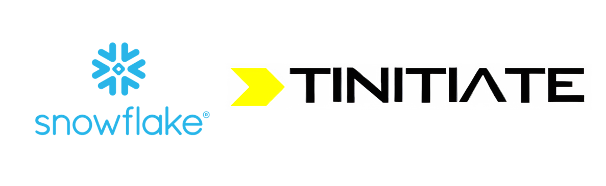

# Snowflake
&copy; TINITIATE.COM

##### [Back To Context](./README.md)

# Platform As A Service (PaaS)

## What is Platform As A Service (PaaS)?

Platform As A Service, or PaaS, is like having a super helpful workspace in the cloud (online) where you can build and run your own applications without worrying about the nitty-gritty details of managing the hardware and software. Think of it as a ready-made workshop with all the tools you need to create awesome projects!

## Why Do We Use PaaS?

Here are some reasons why PaaS is so useful:

1. **Ready-Made Environment**: PaaS provides a pre-configured environment with all the tools you need, saving you the time and effort of setting everything up.
2. **Focus on Development**: You can focus on writing code and developing your application without worrying about managing servers, storage, or other infrastructure.
3. **Scalability**: Easily scale your application up or down based on demand without worrying about the underlying infrastructure.
4. **Cost-Efficient**: Pay only for what you use, avoiding the costs of purchasing and maintaining hardware.
5. **Collaboration**: Multiple developers can work together on the same project from different locations.

## How Does PaaS Work?

PaaS provides a complete development and deployment environment in the cloud. Here’s how it works in simple steps:

1. **Sign Up**: You sign up for a PaaS service, like Google App Engine, Microsoft Azure App Service, or AWS Elastic Beanstalk.
2. **Development Environment**: PaaS provides you with an online workspace that includes all the tools and software you need to build your application.
3. **Build and Deploy**: You write your code and deploy your application directly to the PaaS platform. The platform takes care of all the underlying infrastructure.
4. **Manage and Scale**: You can manage your application, monitor its performance, and scale resources as needed, all through the PaaS interface.

## Example of Using PaaS in Everyday Life

Let’s say you want to create an online game for your friends. Here’s how PaaS can help:

1. **Choose a PaaS Service**: You sign up for a PaaS service like Microsoft Azure App Service.
2. **Set Up Your Workspace**: The PaaS service provides you with a ready-to-use workspace where you can start coding your game.
3. **Write Your Code**: You use the tools provided by the PaaS platform to write the code for your game.
4. **Deploy Your Game**: Once your game is ready, you deploy it to the PaaS platform, which makes it available online.
5. **Invite Your Friends**: Your game is now live, and your friends can play it from anywhere by accessing the web link.

## Benefits of PaaS

Here are some of the key benefits of using PaaS:

1. **Ease of Use**: PaaS platforms are designed to be user-friendly, making it easy for developers to get started quickly.
2. **Flexibility**: You can choose the tools and services that best meet your needs and easily integrate them into your application.
3. **Automatic Updates**: The PaaS provider takes care of software updates and security patches, so you don’t have to worry about keeping your environment up to date.
4. **Enhanced Collaboration**: Developers can collaborate more effectively using shared tools and environments.

## Conclusion

Platform As A Service (PaaS) is a powerful tool that provides a ready-made environment for developing and deploying applications in the cloud. It simplifies the development process by taking care of the underlying infrastructure, allowing developers to focus on creating great applications. With PaaS, you can easily build, deploy, and scale your applications, making it an essential service in the modern digital world.

##### [Back To Context](./README.md)
***
| &copy; TINITIATE.COM |
|----------------------|