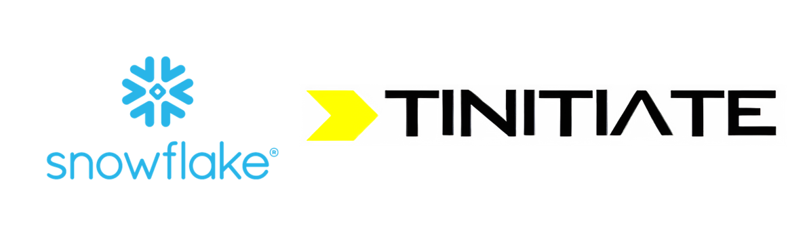

# Snowflake Tutorial
&copy; TINITIATE.COM

##### [Back To Context](./README.md)

# Traditional RDBMS vs Snowflake Platform

## What is a Traditional RDBMS?

A Traditional Relational Database Management System (RDBMS) is like a big digital notebook where data is stored in tables. Each table has rows (like lines in a notebook) and columns (like different sections for different types of information). Examples of traditional RDBMS include MySQL, Oracle, and SQL Server. These systems have been used for many years to store and manage data for various applications.

## What is the Snowflake Platform?

The Snowflake Platform is a modern cloud-based data warehousing service. It's like a super-organized online library that you can access over the internet. Snowflake is designed to store, manage, and analyze large amounts of data efficiently. Unlike traditional RDBMS, Snowflake is a Software as a Service (SaaS) that takes care of all the technical details, so you don’t have to.

## Key Differences Between Traditional RDBMS and Snowflake

Here are some of the key differences between Traditional RDBMS and the Snowflake Platform:

### 1. **Infrastructure Management**

- **Traditional RDBMS**: Requires you to manage hardware and software. You need to set up servers, install software, and handle updates and backups.
- **Snowflake**: All the hardware and software management is done for you in the cloud. You don’t have to worry about servers, installations, or maintenance.

### 2. **Scalability**

- **Traditional RDBMS**: Scaling up (adding more resources) can be complex and expensive. You might need to buy more hardware or reconfigure your system.
- **Snowflake**: Easily scalable. You can adjust the amount of storage and compute power you need with just a few clicks, and you only pay for what you use.

### 3. **Performance**

- **Traditional RDBMS**: Performance can slow down with large amounts of data or high user activity. You might need to optimize queries and manage indexes.
- **Snowflake**: Designed for high performance with large datasets and many users. It uses a unique architecture that separates storage and compute resources, allowing for faster processing.

### 4. **Data Types and Flexibility**

- **Traditional RDBMS**: Primarily designed for structured data (data that fits neatly into tables). Handling semi-structured data (like JSON files) can be challenging.
- **Snowflake**: Can handle both structured and semi-structured data easily. It’s flexible and can process various data types without complex configurations.

### 5. **Cost**

- **Traditional RDBMS**: You need to invest in hardware, software licenses, and ongoing maintenance, which can be costly.
- **Snowflake**: Uses a pay-as-you-go pricing model. You pay based on the storage and compute resources you use, which can be more cost-effective.

## Example of Using Traditional RDBMS vs Snowflake

Let’s say your school wants to track student information and analyze performance data.

### Using Traditional RDBMS:

1. **Setup**: You need to buy servers, install database software, and configure the system.
2. **Data Entry**: Enter student data into tables.
3. **Maintenance**: Regularly update software, manage backups, and optimize performance.
4. **Scaling**: If you need more space or processing power, you have to buy more hardware and configure it.

### Using Snowflake:

1. **Setup**: Sign up for Snowflake and create an account. No hardware or software installation needed.
2. **Data Entry**: Enter student data into Snowflake’s tables or upload semi-structured data like JSON files.
3. **Maintenance**: Snowflake automatically handles updates, backups, and optimizations.
4. **Scaling**: Adjust storage and compute resources as needed with a few clicks.

## Benefits of Using Snowflake Over Traditional RDBMS

Here are some of the key benefits of using Snowflake over Traditional RDBMS:

1. **Ease of Use**: Snowflake is user-friendly and doesn’t require technical management of hardware and software.
2. **Flexibility**: Handles both structured and semi-structured data efficiently.
3. **Scalability**: Easily scales up or down based on your needs.
4. **Cost Efficiency**: Pay only for the resources you use, without the need for large upfront investments.
5. **High Performance**: Optimized for fast data processing and can handle large volumes of data and high user activity.

## Conclusion

Traditional RDBMS have been reliable systems for managing data for many years. However, the Snowflake Platform offers a modern, cloud-based solution that simplifies data management, provides greater flexibility, and delivers high performance. With Snowflake, you can focus on using your data to gain insights and make decisions without worrying about the technical complexities. Snowflake is an essential tool for anyone looking to manage large amounts of data efficiently in today’s digital world.

##### [Back To Context](./README.md)
***
| &copy; TINITIATE.COM |
|----------------------|